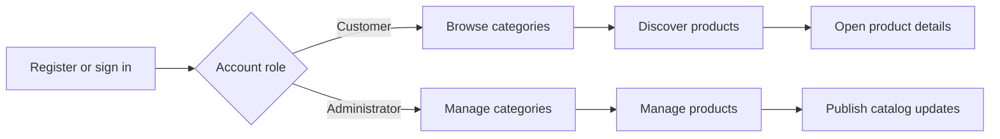
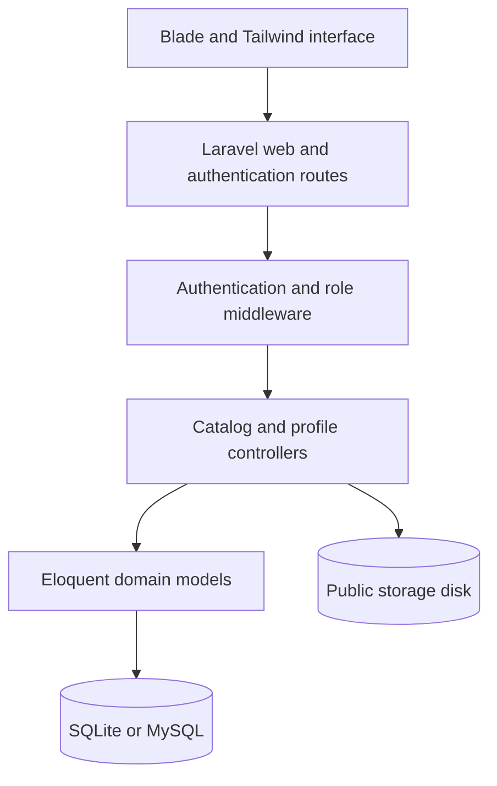

<p align="center">
  
</p>

<h1 align="center">PBL Maestro PT2</h1>

<p align="center">
  A Project Based Learning release that turns a fashion-catalog brief into a
  role-aware Laravel application for product discovery and content operations.
</p>

<p align="center">
  
  
  
  
  
  
</p>

> [!IMPORTANT]
> This repository is an educational open-source release, not a production
> commerce service. It contains no runtime database, account records, uploaded
> catalog media, private environment files, API keys, or deployment secrets.

## Project Based Learning Context

**PBL** stands for **Project Based Learning**. PBL Maestro PT2 represents the
second learning phase: a practical product brief is translated into user roles,
domain models, authenticated workflows, catalog interfaces, and maintainable
application structure.

The project connects classroom outcomes with concrete engineering work across
requirements analysis, relational modeling, Laravel conventions, role-based
authorization, media handling, responsive interfaces, testing, documentation,
and responsible open-source publication.

## Overview

Maestro is a Laravel fashion-catalog application with distinct customer and
administrator journeys. Authenticated customers can browse categories, inspect
products, and manage their account profile. Administrators receive dedicated
category and product workspaces for creating, editing, and removing catalog
content and associated images.

The public edition preserves the original application and commit provenance
while removing a hard-coded demonstration account. Privileged accounts must be
created locally so a published repository never doubles as a credential source.

## Product At A Glance

| Area | Experience |
| --- | --- |
| Authentication | Registration, sign-in, password recovery, and profile management |
| Catalog discovery | Category navigation, new arrivals, product details, and pricing |
| Product operations | Administrator CRUD workflows with catalog-image storage |
| Category operations | Administrator CRUD workflows for catalog groupings |
| Access model | Separate authenticated customer and administrator middleware |
| Data layer | Eloquent models and migrations for users, products, and categories |

## Experience Model



## Architecture



## Technology Profile

| Layer | Technology | Responsibility |
| --- | --- | --- |
| Application | Laravel 11, PHP 8.2+ | Routing, validation, authentication, and domain workflows |
| Interface | Blade, Tailwind CSS, Alpine.js | Responsive catalog and administration views |
| Data | Eloquent, SQLite or MySQL | Users, roles, products, categories, sessions, and queues |
| Assets | Vite 5, PostCSS, npm | Front-end compilation and development workflow |
| Quality | PHPUnit, Laravel Pint | Feature tests, unit tests, and PHP formatting |

## Repository Map

| Path | Purpose |
| --- | --- |
| `app/Http/Controllers` | Catalog, authentication, and profile request handling |
| `app/Http/Middleware` | Customer and administrator role boundaries |
| `app/Models` | User, product, and category domain models |
| `database/migrations` | Reproducible application schema |
| `resources/views` | Customer, catalog, account, and administration interfaces |
| `routes` | Web, authentication, and console entry points |
| `tests` | Authentication, profile, feature, and unit coverage |

## Getting Started

Requirements: PHP 8.2 or newer, Composer, Node.js 20 or newer, and npm.

```bash
git clone https://github.com/ibamzjr/PBL-Maestro-PT2.git
cd PBL-Maestro-PT2
composer install
cp .env.example .env
php artisan key:generate
php -r "file_exists('database/database.sqlite') || touch('database/database.sqlite');"
php artisan migrate
npm install
npm run build
php artisan storage:link
php artisan serve
```

Open `http://127.0.0.1:8000/register` to create a local customer account. If an
administrator is required for study, promote a locally created account through
Laravel Tinker; never commit its email address or password.

```bash
php artisan tinker
```

```php
App\Models\User::where('email', 'admin@example.test')->update(['role' => 'admin']);
```

## Responsible Publication

- `.env`, local databases, uploads, caches, logs, and generated build output are
  excluded from Git.
- The demonstration administrator credential from the source snapshot has been
  removed from the public seeder.
- User uploads remain runtime data under the configured public storage disk.
- Production use requires authorization review, upload hardening, observability,
  rate limiting, backups, and a deployment-specific security assessment.

Review [SECURITY.md](SECURITY.md) before adapting the project beyond local study.

## Project Status

PBL Maestro PT2 is suitable for code review, local demonstration, coursework,
and continued open-source learning. It is not presented as a complete storefront:
payment processing, order fulfillment, inventory reconciliation, production
media governance, and commercial compliance remain outside this phase.

## Provenance

The application began in
[anantariskys/Maestro](https://github.com/anantariskys/Maestro), authored by
[anantariskys](https://github.com/anantariskys). The original commit history is
preserved. This edition adds secure publication defaults, Project Based Learning
documentation, portfolio presentation, and ongoing maintenance by
[ibamzjr](https://github.com/ibamzjr).

See [NOTICE.md](NOTICE.md) for the complete attribution boundary.

## License

Source code and original documentation are available under the
[MIT License](LICENSE). Product names, trademarks, and portfolio media retain
their respective ownership as described in [NOTICE.md](NOTICE.md).
