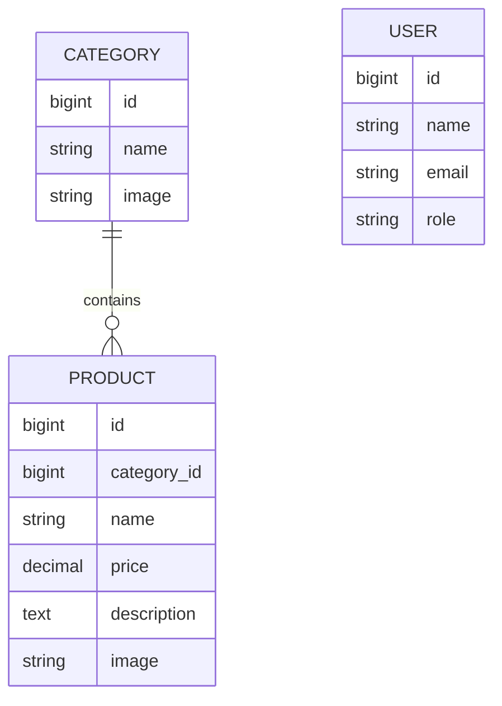

# Catalog Domain Notes

## Purpose

The Maestro catalog domain supports the Project Based Learning objective of
turning a retail brief into a small, understandable Laravel application. It is
intentionally limited to product discovery and content administration.

## Core Entities

### User

A user owns authentication and profile data. The `role` field separates the
customer journey from catalog administration:

- `user` accounts browse categories and products.
- `admin` accounts maintain category and product records.

### Category

A category groups related products and owns one presentation image. Category
names are unique in administrator requests. A category cannot be removed while
products still reference it.

### Product

A product belongs to exactly one category and carries a name, price,
description, and presentation image. Product prices use a non-negative decimal
value, while text and uploads are bounded by request validation.

## Relationships

## Media Lifecycle

Catalog images are stored on Laravel's public disk and referenced by their
relative path. Replacement uploads are written before the previous image is
deleted, reducing the chance that a failed write leaves a record without media.
Deleting a product or an unused category also removes its associated image when
the file exists.

## Publication Boundary

The repository includes application code, migrations, tests, and portfolio
showcase media. Runtime uploads, user records, sessions, local databases, and
environment secrets remain outside Git.

Orders, payments, inventory reconciliation, shipping, promotions, and analytics
are deliberately outside the PT2 learning scope.

